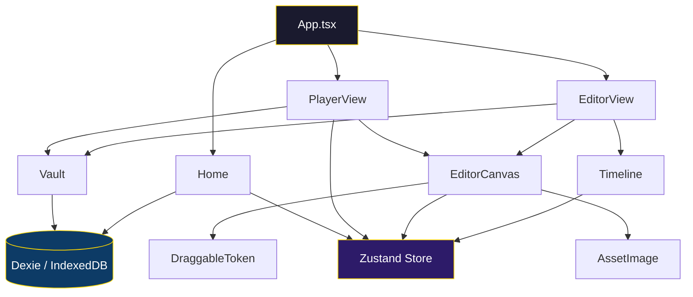
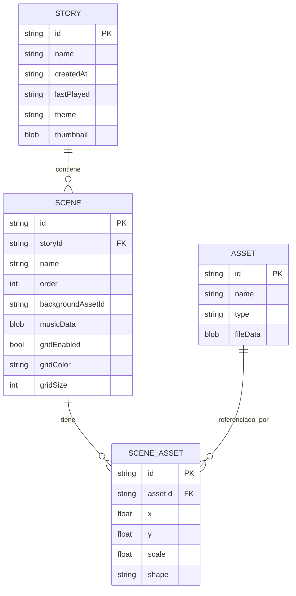

<div align="center">

# 🏰 DungeonFrame

### Motor de Narración Inmersiva para RPGs de Mesa

[](https://react.dev/)
[](https://www.typescriptlang.org/)
[](https://vitejs.dev/)
[](https://tailwindcss.com/)
[](https://opensource.org/licenses/MIT)

**DungeonFrame** es un motor visual web diseñado para **Dungeon Masters** y narradores que quieren construir, editar y presentar escenas inmersivas de RPG de mesa — todo desde el navegador, sin ninguna dependencia de servidor.

🇬🇧 **[Read in English](README.md)**

</div>

---

## ✨ Características

| Característica | Descripción |
|---|---|
| 🎭 **Gestión de Historias** | Crear, renombrar, eliminar, importar y exportar historias como JSON |
| 🗺️ **Editor de Escenas** | Canvas visual con drag-and-drop para mapas, tokens y audio |
| 🎮 **Modo Jugador** | Modo presentación a pantalla completa con navegación entre escenas y audio ambiente |
| 📦 **Bóveda de Assets** | Subir y organizar mapas, tokens y pistas de audio |
| 🔲 **Cuadrícula Configurable** | Overlay de cuadrícula con color y tamaño personalizable por escena |
| 🎵 **Audio por Escena** | Asociar música ambiental a cada escena con reproducción en bucle |
| 💾 **Persistencia Local** | Todos los datos se guardan en IndexedDB mediante Dexie — sin servidor |
| 📤 **Importar / Exportar** | Compartir historias entre sesiones como archivos `.json` |

---

## 🏗️ Arquitectura



---

## 🖥️ Vistas de la Aplicación

### 🏠 Home — Panel de Historias

La página de inicio donde gestionas todas tus historias.

```
┌──────────────────────────────────────────────────────────┐
│                      DungeonFrame                        │
│            Motor de Narración Inmersiva                   │
│                                                          │
│  ┌──────────┐  ┌──────────┐  ┌──────────┐  ┌──────────┐ │
│  │          │  │          │  │  Guarida  │  │  La      │ │
│  │ + Nueva  │  │ Importar │  │  del      │  │  Cripta  │ │
│  │ Historia │  │   JSON   │  │  Dragón   │  │          │ │
│  │          │  │          │  │ ▶ Jugar  │  │ ▶ Jugar  │ │
│  │          │  │          │  │ ✏ Editar │  │ ✏ Editar │ │
│  │          │  │          │  │ ⬇ Export │  │ ⬇ Export │ │
│  └──────────┘  └──────────┘  └──────────┘  └──────────┘ │
└──────────────────────────────────────────────────────────┘
```

**Acciones disponibles por historia:**
- ▶ **Jugar** — Lanzar en Modo Jugador
- ✏️ **Editar** — Abrir en el Editor de Escenas
- ⬇️ **Exportar** — Descargar como `.json`
- ✏️ **Renombrar** — Cambiar nombre de la historia
- 🗑️ **Eliminar** — Borrar historia

---

### ✏️ Editor — Constructor de Escenas

El espacio de trabajo principal donde construyes tus escenas.

```
┌────────────┬─────────────────────────────────────────────┐
│            │                              [Volver][Guardar]│
│  BÓVEDA    │                                             │
│            │           CANVAS DEL EDITOR                 │
│  [Mapas]   │                                             │
│  [Tokens]  │     ┌───┐          ┌───┐                    │
│  [Audio]   │     │ 🧙 │         │ 🐉 │                   │
│            │     └───┘          └───┘                    │
│  ┌──────┐  │          ┌───┐                              │
│  │subir │  │          │ ⚔️ │                              │
│  └──────┘  │          └───┘                              │
│  ┌──┐┌──┐  │                                             │
│  │  ││  │  │    ░░░░░░░░░░░░   (overlay de cuadrícula)   │
│  └──┘└──┘  │                                             │
├────────────┴─────────────────────────────────────────────┤
│  LÍNEA DE TIEMPO                                         │
│  [Escena 1] [Escena 2] [Escena 3]      [+ Nueva Escena] │
└──────────────────────────────────────────────────────────┘
```

**Funcionalidades clave:**
- **Panel Bóveda** (izquierda) — Subir y explorar Mapas, Tokens y Audio
- **Canvas** (centro) — Arrastra assets desde la Bóveda al canvas
- **Línea de Tiempo** (abajo) — Crear, seleccionar y gestionar escenas; activar cuadrícula por escena
- **Drag & Drop** — Arrastra mapas para fondo, tokens para colocar en escena, audio para música
- **Controles de Token** — Pasa el ratón sobre tokens para escalar (±), cambiar forma (círculo/cuadrado) o eliminar

---

### 🎮 Jugador — Modo Presentación

La vista inmersiva diseñada para sesiones en vivo.

```
┌──────────────────────────────────────────────────────────┐
│ [Volver] [Bóveda] [Escenas] [Cuadrícula]          [⛶]   │
│                                                          │
│                                                          │
│                                                          │
│  ◀            VISUALIZACIÓN DE ESCENA               ▶    │
│                                                          │
│                (canvas a pantalla completa)               │
│                (audio ambiental en bucle)                 │
│                                                          │
│                                                          │
│                  Nombre de la Escena                     │
└──────────────────────────────────────────────────────────┘
```

**Controles:**
- ◀ / ▶ — Navegar entre escenas
- **Bóveda** — Abrir panel lateral de tokens para colocarlos durante la partida
- **Escenas** — Selector rápido de escenas
- **Cuadrícula** — Activar/desactivar overlay de cuadrícula
- **⛶** — Alternar pantalla completa
- La música ambiental se reproduce automáticamente y se repite por escena

---

## 🔧 Stack Tecnológico

| Capa | Tecnología |
|---|---|
| **Framework** | React 19 + TypeScript 5.9 |
| **Empaquetador** | Vite 7 |
| **Estilos** | TailwindCSS 4 + PostCSS |
| **Estado Global** | Zustand 5 |
| **Base de Datos** | Dexie 4 (wrapper de IndexedDB) |
| **Drag & Drop** | react-draggable + @dnd-kit |
| **Animaciones** | Framer Motion 12 |
| **Iconos** | Lucide React |
| **IDs** | uuid v13 |

---

## 🚀 Primeros Pasos

### Requisitos Previos

- **Node.js** ≥ 18
- **npm** ≥ 9

### Instalación

```bash
# Clonar el repositorio
git clone https://github.com/pentarix1996/D-DMaker.git
cd D-DMaker

# Instalar dependencias
npm install

# Iniciar el servidor de desarrollo
npm run dev
```

La aplicación estará disponible en `http://localhost:5173`.

### Compilar para Producción

```bash
npm run build
npm run preview
```

---

## 📂 Estructura del Proyecto

```
src/
├── components/          # Componentes UI reutilizables
│   ├── AssetImage.tsx   # Renderiza assets desde blobs de IndexedDB
│   └── ui/
│       ├── Button.tsx   # Componente de botón con tema
│       └── GlassPanel.tsx # Panel con efecto glassmorphism
├── db/
│   └── index.ts         # Base de datos Dexie (stories, scenes, assets)
├── features/
│   ├── editor/
│   │   ├── DraggableToken.tsx  # Token con controles de arrastre, escala y forma
│   │   ├── EditorCanvas.tsx    # Canvas principal con zonas de drop
│   │   ├── EditorView.tsx      # Layout del editor (Bóveda + Canvas + Timeline)
│   │   └── Timeline.tsx        # Franja de escenas con controles de cuadrícula
│   ├── home/
│   │   └── Home.tsx            # Panel de historias (CRUD + import/export)
│   ├── player/
│   │   └── PlayerView.tsx      # Modo presentación con navegación
│   └── vault/
│       └── Vault.tsx           # Biblioteca de assets (mapas, tokens, audio)
├── hooks/
│   └── useAssets.ts     # Hook para operaciones CRUD sobre assets
├── store/
│   └── gameStore.ts     # Store de Zustand para el estado de sesión
├── types/
│   └── index.ts         # Interfaces TypeScript (Story, Scene, Asset…)
├── lib/
│   └── utils.ts         # Funciones utilitarias (cn, etc.)
├── App.tsx              # Componente raíz con enrutamiento de vistas
├── main.tsx             # Punto de entrada
├── App.css              # Estilos de la aplicación
└── index.css            # Estilos globales y directivas de Tailwind
```

---

## 📊 Modelo de Datos



---

## 🤝 Contribuir

1. Haz un fork del repositorio
2. Crea una rama para tu funcionalidad (`git checkout -b feature/funcionalidad-increible`)
3. Haz commit de tus cambios (`git commit -m 'Añadir funcionalidad increíble'`)
4. Sube la rama (`git push origin feature/funcionalidad-increible`)
5. Abre un Pull Request

---

## 📜 Licencia

Este proyecto está licenciado bajo la **Licencia MIT** — consulta el archivo [LICENSE](LICENSE) para más detalles.

---

<div align="center">

**Hecho con ❤️ para Dungeon Masters de todo el mundo**

*Tira iniciativa. Cuenta tu historia.*

</div>
