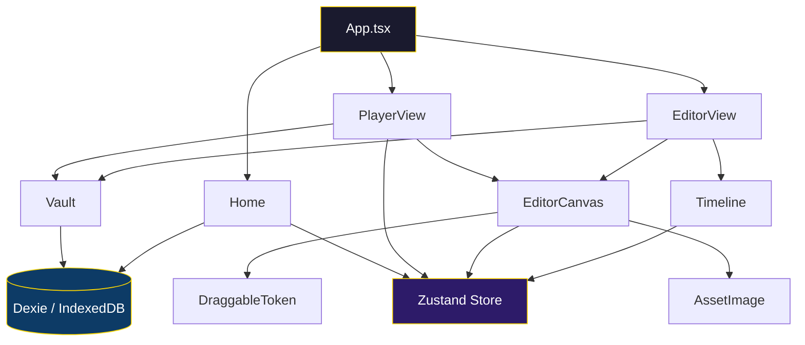
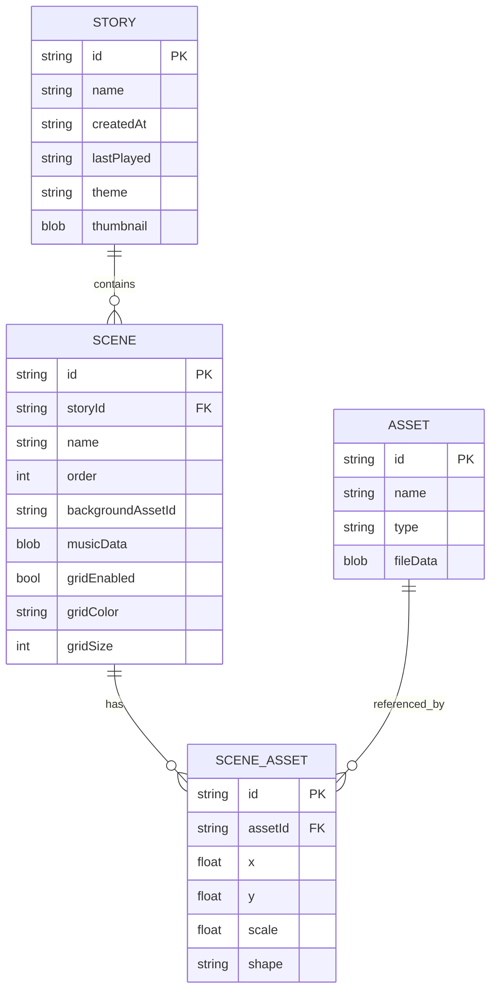

<div align="center">

# 🏰 DungeonFrame

### Immersive Storytelling Engine for Tabletop RPGs

[](https://react.dev/)
[](https://www.typescriptlang.org/)
[](https://vitejs.dev/)
[](https://tailwindcss.com/)
[](https://opensource.org/licenses/MIT)

**DungeonFrame** is a web-based visual engine designed for **Dungeon Masters** and storytellers who want to build, edit, and present immersive tabletop RPG scenes — all from the browser, with zero server dependencies.

🇪🇸 **[Leer en Español](README-ES.md)**

</div>

---

## ✨ Features

| Feature | Description |
|---|---|
| 🎭 **Story Management** | Create, rename, delete, import and export stories as JSON |
| 🗺️ **Scene Editor** | Visual canvas with drag-and-drop for maps, tokens and audio |
| 🎮 **Player Mode** | Fullscreen presentation mode with scene navigation and ambient audio |
| 📦 **Asset Vault** | Upload and organize maps, tokens and audio tracks |
| 🔲 **Configurable Grid** | Toggle grid overlay with custom color and size per scene |
| 🎵 **Scene Audio** | Attach ambient music to each scene with auto-loop playback |
| 💾 **Local Persistence** | All data stored in IndexedDB via Dexie — no server required |
| 📤 **Import / Export** | Share stories between sessions as `.json` files |

---

## 🏗️ Architecture



---

## 🖥️ Application Views

### 🏠 Home — Story Dashboard

The landing page where you manage all your stories.

```
┌──────────────────────────────────────────────────────────┐
│                      DungeonFrame                        │
│              Immersive Storytelling Engine                │
│                                                          │
│  ┌──────────┐  ┌──────────┐  ┌──────────┐  ┌──────────┐ │
│  │          │  │          │  │  Dragon   │  │  The     │ │
│  │  + New   │  │  Import  │  │  Keep     │  │  Crypt   │ │
│  │  Story   │  │  JSON    │  │          │  │          │ │
│  │          │  │          │  │ ▶ Play   │  │ ▶ Play   │ │
│  │          │  │          │  │ ✏ Edit   │  │ ✏ Edit   │ │
│  │          │  │          │  │ ⬇ Export │  │ ⬇ Export │ │
│  └──────────┘  └──────────┘  └──────────┘  └──────────┘ │
└──────────────────────────────────────────────────────────┘
```

**Actions available per story:**
- ▶ **Play** — Launch in Player Mode
- ✏️ **Edit** — Open in the Scene Editor
- ⬇️ **Export** — Download as `.json`
- ✏️ **Rename** — Change story name
- 🗑️ **Delete** — Remove story

---

### ✏️ Editor — Scene Builder

The main workspace where you build your scenes.

```
┌────────────┬─────────────────────────────────────────────┐
│            │                                   [Back][Save]│
│   VAULT    │                                             │
│            │            EDITOR CANVAS                    │
│  [Maps]    │                                             │
│  [Tokens]  │     ┌───┐          ┌───┐                    │
│  [Audio]   │     │ 🧙 │         │ 🐉 │                   │
│            │     └───┘          └───┘                    │
│  ┌──────┐  │          ┌───┐                              │
│  │upload│  │          │ ⚔️ │                              │
│  └──────┘  │          └───┘                              │
│  ┌──┐┌──┐  │                                             │
│  │  ││  │  │    ░░░░░░░░░░░░   (grid overlay)            │
│  └──┘└──┘  │                                             │
├────────────┴─────────────────────────────────────────────┤
│  TIMELINE                                                │
│  [Scene 1] [Scene 2] [Scene 3]           [+ New Scene]   │
└──────────────────────────────────────────────────────────┘
```

**Key features:**
- **Vault Panel** (left) — Upload and browse Maps, Tokens, and Audio
- **Canvas** (center) — Drag assets from the Vault onto the canvas
- **Timeline** (bottom) — Create, select and manage scenes; toggle grid per scene
- **Drag & Drop** — Drag maps to set background, tokens to place on stage, audio to set music
- **Token Controls** — Hover over tokens to scale (±), toggle shape (circle/square), or delete

---

### 🎮 Player — Presentation Mode

The immersive view designed for live sessions.

```
┌──────────────────────────────────────────────────────────┐
│ [Back] [Vault] [Scenes] [Grid]                    [⛶]   │
│                                                          │
│                                                          │
│                                                          │
│  ◀              SCENE DISPLAY                       ▶    │
│                                                          │
│                  (fullscreen canvas)                      │
│                  (ambient audio loops)                    │
│                                                          │
│                                                          │
│                    Scene Name                            │
└──────────────────────────────────────────────────────────┘
```

**Controls:**
- ◀ / ▶ — Navigate between scenes
- **Vault** — Open token sidebar to place tokens during play
- **Scenes** — Quick scene selector dropdown
- **Grid** — Toggle grid overlay
- **⛶** — Toggle fullscreen mode
- Ambient music plays automatically and loops per scene

---

## 🔧 Tech Stack

| Layer | Technology |
|---|---|
| **Framework** | React 19 + TypeScript 5.9 |
| **Bundler** | Vite 7 |
| **Styling** | TailwindCSS 4 + PostCSS |
| **State Management** | Zustand 5 |
| **Database** | Dexie 4 (IndexedDB wrapper) |
| **Drag & Drop** | react-draggable + @dnd-kit |
| **Animations** | Framer Motion 12 |
| **Icons** | Lucide React |
| **IDs** | uuid v13 |

---

## 🚀 Getting Started

### Prerequisites

- **Node.js** ≥ 18
- **npm** ≥ 9

### Installation

```bash
# Clone the repository
git clone https://github.com/pentarix1996/D-DMaker.git
cd D-DMaker

# Install dependencies
npm install

# Start the dev server
npm run dev
```

The app will be available at `http://localhost:5173`.

### Build for Production

```bash
npm run build
npm run preview
```

---

## 📂 Project Structure

```
src/
├── components/          # Reusable UI components
│   ├── AssetImage.tsx   # Renders assets from IndexedDB blobs
│   └── ui/
│       ├── Button.tsx   # Themed button component
│       └── GlassPanel.tsx # Glassmorphism panel
├── db/
│   └── index.ts         # Dexie database (stories, scenes, assets)
├── features/
│   ├── editor/
│   │   ├── DraggableToken.tsx  # Token with drag, scale, shape controls
│   │   ├── EditorCanvas.tsx    # Main canvas with drop zones
│   │   ├── EditorView.tsx      # Editor layout (Vault + Canvas + Timeline)
│   │   └── Timeline.tsx        # Scene strip with grid controls
│   ├── home/
│   │   └── Home.tsx            # Story dashboard (CRUD + import/export)
│   ├── player/
│   │   └── PlayerView.tsx      # Presentation mode with navigation
│   └── vault/
│       └── Vault.tsx           # Asset library (maps, tokens, audio)
├── hooks/
│   └── useAssets.ts     # Hook for CRUD operations on assets
├── store/
│   └── gameStore.ts     # Zustand store for session state
├── types/
│   └── index.ts         # TypeScript interfaces (Story, Scene, Asset…)
├── lib/
│   └── utils.ts         # Utility functions (cn, etc.)
├── App.tsx              # Root component with view routing
├── main.tsx             # Entry point
├── App.css              # Application styles
└── index.css            # Global styles & Tailwind directives
```

---

## 📊 Data Model



---

## 🤝 Contributing

1. Fork the repository
2. Create a feature branch (`git checkout -b feature/amazing-feature`)
3. Commit your changes (`git commit -m 'Add amazing feature'`)
4. Push to the branch (`git push origin feature/amazing-feature`)
5. Open a Pull Request

---

## 📜 License

This project is licensed under the **MIT License** — see the [LICENSE](LICENSE) file for details.

---

<div align="center">

**Built with ❤️ for Dungeon Masters everywhere**

*Roll initiative. Tell your story.*

</div>